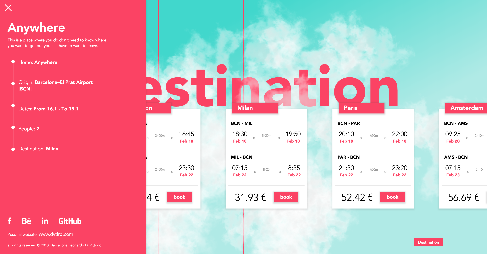

## Wherever

Book the cheapest random flight with a all brand new navigation through the clouds.

## Project aim

This is my first solo project from scratch done with React.js. I wanted to create a nice user experience to book flights with an alternative way to scroll on the page.
In this portal you have to select the origin place, the dates and the number of passengers, then the api looks for the cheapest solution for you. The animation are done with Green Sock.

## Steps

* ### Home page
    This is how you land in the web site, like in a sky full of clouds
    
* ### Choose Origin
  Scrolling down you reach the first field for the research, the origin place. It takes the position from the browser and search for the nearest airport. The autocomplete search bar sudggest you the other airports based on the input.
    
* ### Calendar
    Then the second step is the calendar where you can select the date that you prefer. As you click its update in realtime. Built from scratch
     
* ### Passengers
    Last step for the research is the number of passenger.
    
* ### Destination
    Once you fill in al field you can reach the end where the api returns the cheapest random destinations. You can choose your favourite and clicking on Book you're redirect to the page to book the flight.
    
* ### Menu
  In the menu you have a overview on your search and my contacts.
    

## Contact Me

Leonardo Di Vittorio – [Linkedin](https://www.linkedin.com/in/leonardo-di-vittorio-092679a6/) – leodivittorio@gmail.com

To see other project checkout my [GitHub profile](https://github.com/Leon31)
